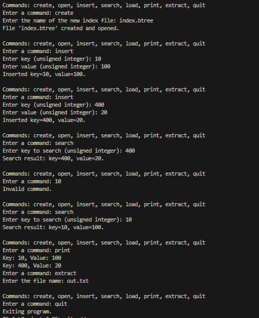

12/3/2024

I created the python file and printed a simple menu consisting of all the commands.

Created the Github

12/8/2024 1:30AM - 3:50AM

I didn't read all the way through the instructions and didn't see the part about the github til now. I created the Repo and created the original devlog file on the github page. I worked on the logic behind all the commands (create, open, insert,search,load, print, extract, quit). I'm currently having issues with the insert, search, load and extract as they have to be developed as im creating the index file and B-tree implemetation. I tried pushing into the repo and I was running into some issues with "main" branch. I googled the issues and saw that there is a git push force command and I used this command to push my code. However, this deleted my original devlog file and pushed the code into main branch. I think from now on, I'm going to create another branch and then merge it to the main branch. I attemped my regular push to main and it works now?? I don't know what happened originally but it's working now. No need to do pull and merges.

12/8/2024 1:28PM

Started working on the B-Tree Structure. I have to create the B-Tree node class which includes the Block ID, Parent block ID, num of key value pairs, and array of keys, values, and child pointers. I also have to create methods to read and write a node from or to the index file. An issue I ran into while implementing the B-Tree class was the commands weren't printing properly. The insert command doesn't store the key value pair in a data structure, it just displays the input. This needs to be changed so the BTreeNode class stores the key value pairs in the B-Tree structure. The Seach command doesn't search the B-Tree, it just prints the input, so this needs to be changed also. The Print command doesn't print anything right now, it needs to print the stored key value pairs. The Extract command doesn't read and extract the key-value pairs, it's just null at the moment. So essentially, all the commands need to be changed so it works along the B-Tree.

12/8/2024 5:01PM

Finished the B-Tree Structure in the BTreeNode class. The __init__ constructor initialized a new BTreeNode object. It contained the parameters that stored the unique id of the block where this node resides in the file and the id of the parent node block. The serialize def converts the node into a binary format that can be written to a file. It essentially packs the attributes that were created in the __init__ constructor into a binary string using struct.pack. Then for each key value pair in the node, it adds the key and value to the binary data, using 8 bytes for each and adds the children array. This def returns a binary string representing the serialised node. The deserialize def creates a BTreeNode object from a binary block of data read from a file. It essentially reconstructs a node from a binary block of data read from a file, making it usable in memory. It returns a BTreeNode object reconstructed from the binary data. 

Example Output:

